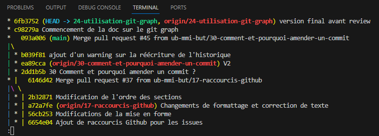

# Utilisation de Git Log / Git Graph

## Git Log

Lors de projet Git, la commande `git commit`, qui permet de créer des instantanés du projet et d'enregistrer les modifications du projet, est très souvent utilisé. Tous les `commit` sont enregistrer dans un historique qui peut vite devenir compliqué à explorer. C'est pourquoi il existe une commande `git log` qui permet d'afficher les commits, de les filtrer et même de rechercher une modification précise.

Pour obtenir un rendu graphique des commits de la branche, utilisez la commande ci-dessous:
 ```
 git log --graph --oneline
 ```



Pour obtenir un rendu graphique de toutes les branches du projet, utilisez la commande ci-dessous:
 ```
 git log --graph --oneline --all
 ```

### Syntaxe de Git Log

|`git log`|La commande par défaut liste tous les commits dans l’ordre inverse|
|---|---|
|`git log --graph --oneline`|Liste les modifications sous forme graphique de la branche|
|`git log --graph --oneline --decorate --all`|Liste les modifications sous forme graphique de toutes les branches du repository|
|`git log -p`|Affiche le contexte des modifications|
|`git log --stat`|Affiche les statistiques de modifications avec une liste claire|
|`git log --oneline`|Regroupe chaque commit sur une ligne pour un meilleur aperçu|
|`git log -n <nombre>`|Limite le nombre de commits affichés|
|`git log --author="nom de l’auteur"`|Affiche uniquement les commits d’un auteur donné|
|`git log --grep="message"`|Filtre les commits en fonction de leur explication|
|`git log <since>..<until>`|Affiche uniquement les commits sur une période donnée|
|`git log <fichier>`|Affiche uniquement les commits qui contiennent un fichier spécifique|
|`git log --pretty`|Modifie le format de la sortie selon ses propres spécifications|

Pour plus de détails sur les commandes `git log`, lancez la commande `git log --help`. Cette commande vous ouvrira une page navigateur qui répertorie toutes les commandes git log avec tous les filtres possibles.


## Qu'est ce qu'un Git Graph ?

Un Git Graph est une représentation/revisualisation des **commits** et des évènements sur les différentes branches du projet.


**Légende**

- Chaque trait de couleur représente une branche du projet, le nom de la branche est affiché
- Chaque point représente un commit de la branche


## Comment avoir accès au Git Graph du projet ?


### Github

Pour avoir accès au Git Graph du projet, il suffit d'aller sur l'onglet `Insight` de la barre de navigation de Github.


Ensuite, choisir `Network` et le graph s'affichera.


### Gitlab

Pour GitLab, il faut aller dans l'onglet `</> Code` puis choisir `Repository graph`. Même fonctionnement que pour Github, chaque couleur défini une branche du projet et chaque point un commit.


## Une extension VS Code

Il existe pour VS Code une extension pêrmettant de prévisualiser les Git Graph directement sur le projet en local, **Git Graph**.


Une fois installer, il suffit de clicker sur le bouton `Git Graph` en bas de page.

