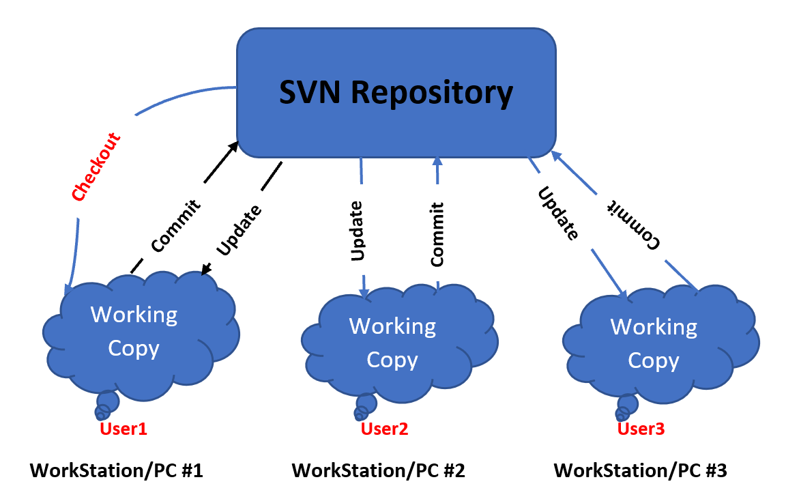
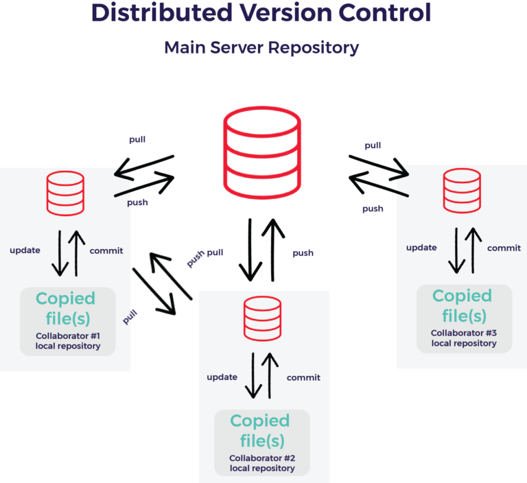

# Modèle décentralisé

Il existe deux modèles, le centralisé et le décentralisé.

- Centralisé : Centralisation du code source du projet, les utilisateurs doivent se connecter au serveur pour travailler dessus. Exemple : SVN

- Décentraliser : Le code source est hébergé sur un serveur distant, les utilisateurs sont cette fois invité à télécharger les fichiers pour pouvoir travailler de leurs cotés. Exemple : GitHub

## Avantages et inconvénients du modèle 

| Avantages | Inconvénients |
| --------- | --------- |
| - Plus rapide  | - Plus complexe | 
| - Plus de back-up | - Gestion des droits d'accès | 
| - Travail hors ligne | - Besoin de synchronisation | 
| - Flexible | 

## .git 

`.git` est un répertoire utiliser par git, il contient toutes les informations nécessaire à git pour suivre les données relatives au projet.    

